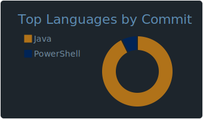
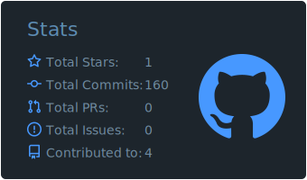
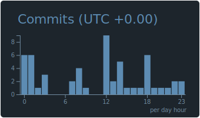
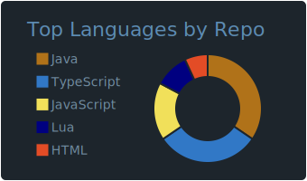
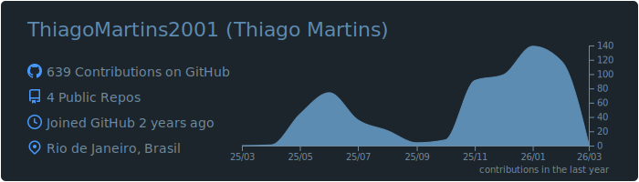

# 👩🏻‍💻 Thiago Martins

### Desenvolvedor FullStack com foco em Java, bots e sistemas para jogos.
Atuo como desenvolvedor **Java**, com foco em backend e construção de soluções organizadas, eficientes e escaláveis. Trabalho no desenvolvimento de sistemas, automações, integrações e ferramentas que resolvem problemas reais do dia a dia, sempre com atenção à lógica, desempenho e estrutura do código.

Minha trajetória em tecnologia começou com o desenvolvimento de scripts e sistemas para jogos, experiência que contribuiu para uma base sólida em lógica e resolução de problemas. Atualmente, concentro minha atuação no desenvolvimento de **aplicações web**, utilizando **Java com Spring Boot**, integração com bancos de dados e criação de **APIs REST**.

Tenho experiência com **React e Next.js** no frontend, além de ferramentas como **Docker** para padronização de ambientes. Também possuo vivência prévia com suporte e infraestrutura de TI, o que influencia minha forma de pensar sistemas, considerando aspectos como **segurança, disponibilidade e manutenção** desde a arquitetura.

Aqui no GitHub você encontrará projetos voltados a backend, sistemas web e estudos práticos em engenharia de software.

---

### 💻 Linguagens e Tecnologias

 
 

### 📊 Estatísticas

    
    
    
    
    

###

 

###
